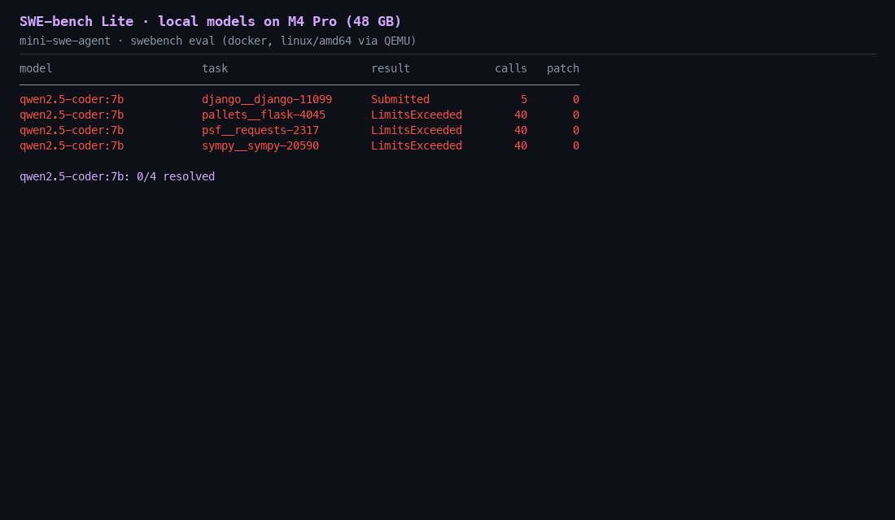

# SWE-bench Lite on local models

Local-only SWE-bench runs against the swarm's own model servers on the M4 Pro
(48 GB): no cloud APIs. The agent is [mini-swe-agent](https://github.com/SWE-agent/mini-swe-agent)
2.4.6; scoring is the official `swebench` harness in Docker (Colima, `linux/amd64`
images under QEMU).



## Results (2026-09-24)

| model | server | task | result | model calls | patch |
|---|---|---|---|---|---|
| qwen2.5-coder:7b | ollama :11434 | django__django-11099 | unresolved (submitted empty patch) | 5 | 0 |
| qwen2.5-coder:7b | ollama :11434 | pallets__flask-4045 | unresolved (hit 40-step limit) | 40 | 0 |
| qwen2.5-coder:7b | ollama :11434 | psf__requests-2317 | unresolved (hit 40-step limit) | 40 | 0 |
| qwen2.5-coder:7b | ollama :11434 | sympy__sympy-20590 | unresolved (hit 40-step limit) | 40 | 0 |

**qwen2.5-coder:7b: 0/4 resolved.** Official report: `report-qwen2.5-coder-7b.json`.

Failure modes:

- **django-11099**: found the right file, but its `sed` edit mis-quoted the regex,
  matched nothing, and it submitted the empty diff without checking. (An earlier
  run on 2026-09-21 resolved this same task, so the 7B is right at the edge here.)
- **flask / requests / sympy**: spent the whole step budget writing repro scripts
  through `echo '...'` and breaking bash quoting, and never edited source.

Qwen3.5-27B-6bit (MLX :8321) on django-11099 and sympy-20590 is in progress.
With the other models resident the Mac swaps, and the MLX server has prefix
caching off, so each step re-prefills the whole transcript (≈6.8k tokens at
≈128 tok/s) and decode drops to 1–2 tok/s: ≈2 min per step.

## Reproduce

```bash
cd ~/swe-bench && source .venv/bin/activate
export DOCKER_DEFAULT_PLATFORM=linux/amd64
mini-extra swebench --subset lite --split test \
  --filter '^(sympy__sympy-20590|django__django-11099|psf__requests-2317|pallets__flask-4045)$' \
  -c swebench.yaml -c configs/ollama-qwen.yaml -c agent.mode=yolo \
  -o runs/qwen7b-lite4 -w 2
# preds.json -> preds.jsonl, then score
swebench eval lite -p runs/qwen7b-lite4/preds.jsonl --run-id qwen7b-lite4 -j 1
python make_gif.py swe-bench-local.gif results.json runs/qwen7b-lite4=qwen2.5-coder:7b
```

Use `configs/mlx-qwen35.yaml` for the 27B.
